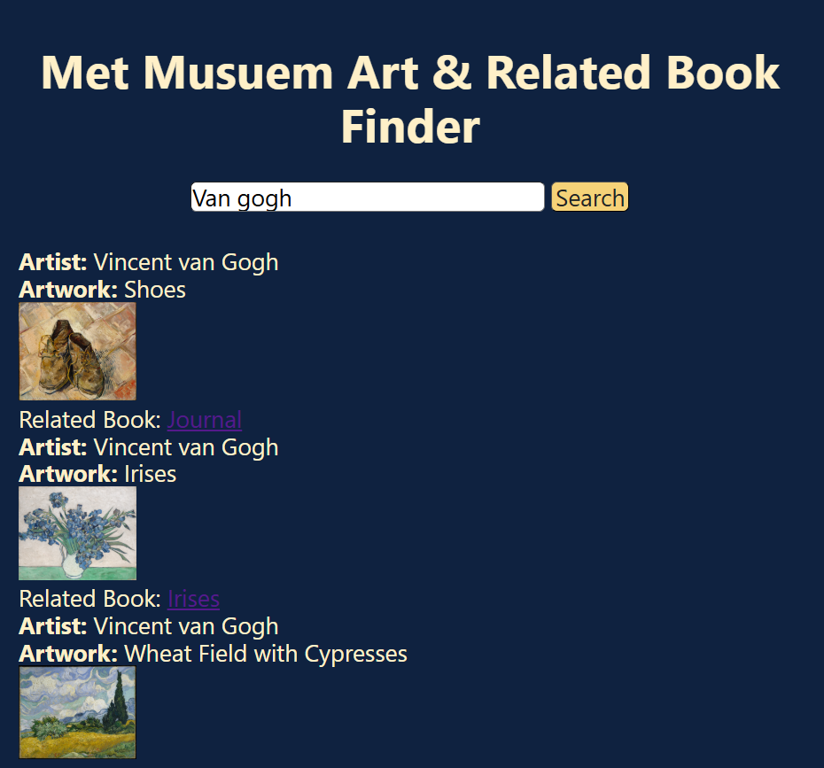

# Musuem and Related Book Finder 

# Description
This website enables user to get art pieces when they type in an artist name and related books to that art piece

## How It's Made:
Tech used: 
- HTML
- CSS
- JavaScript
- API

## Lessons Learned:
- How to integrate API database into JS

## Notes
- Would like to commit better styling to website

#### API Used
- Met Musuem : https://metmuseum.github.io/ 
- Open Library : https://openlibrary.org/dev/docs/api/books 

